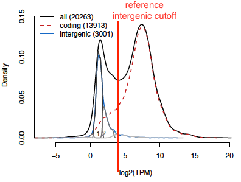
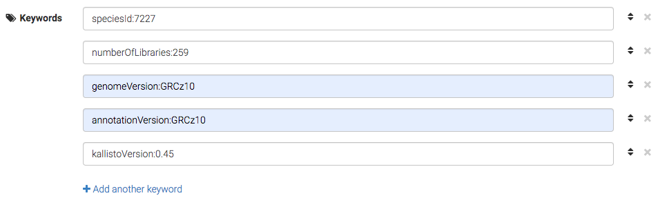

[](https://doi.org/10.1093/nar/gkae1118)
[](https://doi.org/10.1093/nar/gkaa793)
[](https://bsky.app/profile/bgee.org)
[](https://genomic.social/%40bgeedb)

# Protocol to generate reference intergenic sequences:

Generation of reference intergenic sequences is a preliminary step for the generation of [present/absent gene expression calls](https://github.com/BgeeDB/bgee_pipeline/tree/master/pipeline/RNA_Seq#bgee-rna-seq-analysis-pipeline).  
For species present in Bgee these sequences have already been generated and it is possible to reuse them to generate present/absent calls for your own RNA-Seq libraries using the [BgeeCall R package](https://bioconductor.org/packages/release/workflows/html/BgeeCall.html).  
For species absent from Bgee, anyone can generate their own reference intergenic sequences, and then use them to generate present/absent calls. If there is interest, we will establish a platform to share these reference intergenic sequences with the community, allowing other BgeeCall users to reuse reference intergenic sequences. 

Before starting the generation of reference intergenic regions it is important to understand the following:

* One step of this approach sums gene expression level for different libraries. This summed expression is used to detect a subset of reference intergenic region from all intergenic regions automatically generated using both the annotations and the genome. The more libraries you have, the more precise your reference intergenic regions will be. Do not hesitate to use publicly available data in addition to your own, if possible.
* Bgee only integrates healthy and wild type transcriptomic data. The generation of reference intergenic regions has only been tested in this context. We cannot assure you that this approach will work if your libraries come from heterogeneous cancer or knock-out samples.
* The annotation file has to come from Ensembl or should be formatted like Ensembl GTF files (“exon” and “gene” features for column 3, “gene_id”, “transcript_id”, and “gene_biotype” attributes for column 9)
* This approach was not created for single cell RNA-Seq libraries; testing is ongoing.

# 1. Prerequisite
* [kallisto](https://pachterlab.github.io/kallisto/about) (4.4.0 or later)
* [topHat](https://ccb.jhu.edu/software/tophat/index.shtml) (2.1.1 or later): install bowtie2 and tophat; add tophat and gtf_to_fasta to your path
* [R](https://www.r-project.org/) (3.5.0 or later) 
* R packages [tximport](https://bioconductor.org/packages/release/bioc/html/tximport.html), [rtracklayer](https://bioconductor.org/packages/release/bioc/html/rtracklayer.html), [GenomicFeatures](https://bioconductor.org/packages/release/bioc/html/GenomicFeatures.html), [Biostrings](https://bioconductor.org/packages/release/bioc/html/Biostrings.html), and [mclust](https://cran.r-project.org/web/packages/mclust/)
* Perl
* R scripts available [here](https://github.com/BgeeDB/reference_intergenic_standalone/tree/master/scripts)

Of course you will also need :
* the genome annotation (GTF file from Ensembl or similar)
* the genome sequence (FASTA file)
* your RNA-Seq libraries (FASTQ files)

# 2. Generate custom GTF file

Detects a set of regions in the genome without annotations in the GTF file. These regions, called “intergenic regions” will be added to the original gene annotations in a custom GTF file and are defined following these rules :
* at least 500 bp far from any gene annotation;
* at least 1000 bp long;
* if longer than 20 kb only keep 10 kb from each side of the middle of the region;
* no long blocks of Ns (we recommend a limit of 31 bp of consecutive Ns), nor sequences containing more than a certain proportion of Ns (we recommend a limit of 5% of Ns).

<b>inputs : </b> annotation, genome, N blocks size, max proportion of N, output dir  
<b>output : </b> custom GTF with intergenic regions  
<b>command line :</b>  
```
R CMD BATCH --vanilla '--args gene_gtf_path="path/to/gtf_file.gtf" genome_fasta_path="path/to/genome_file.fa" N_block_size=100 N_proportion=0.05 output_gtf_path="path/to/output/custom/gtf_file.gtf"' prepare_GTF.R prepare_GTF.Rout
```

# 3. Generate custom transcriptome

Now that the custom GTF file has been created it is possible to use it to generate a custom transcriptome containing both genes and intergenic sequences.  
For this step Bgee uses TopHat gtf_to_fasta but it is also possible to use BedTools.

<b>input : </b> custom GTF, genome  
<b>output : </b> custom transcriptome  
<b>command lines :</b>  
```
gtf_to_fasta  path/to/genome_file.fa path/to/custom/gtf_file.gtf path/to/output/custom/transcriptome.fa  
perl -i -pe 's/^>\d+ +/>/' path/to/output/custom/transcriptome.fa
```

# 4. Create kallisto index

Generates kallisto indexes using the custom transcriptome previously generated.  
Depending on the read length of the RNA-Seq libraries 2 different indexes with 2 different kmer sizes should be created. If the read length of a RNA-Seq library is small it is better to quantify abundance using a transcriptome index with a smaller kmer size.  
Thus if you have only libraries with read lengths shorter than 50 bp, you need to create a transcriptome index with a kmer size of 15 bp; if you have only libraries with read lengths longer than 50 bp, you need to create a transcriptome index with a kmer size of 31 bp; and if you have libraries with both categories of read lengths, you need to create two indexes, with kmer sizes 15 and 31 bp.  

<b>input : </b> custom transcriptome  
<b>output : </b> kallisto transcriptome indexes  
<b>command lines : </b>  
* read size < 50 bp  
```
kallisto index -k 15 -i output/index/transcriptome_k15.idx path/to/custom/transcriptome.fa  
```
* read size >= 50 bp  
```
kallisto index -k 31 -i output/index/transcriptome.idx path/to/custom/transcriptome.fa  
```

# 5. Quantify abundances of transcripts and intergenic regions

Run kallisto quantification on each library with the previously generated index. Depending on the read size of the library the index generated using a kmer size of 15 bp or 31 bp should be used. Furthermore, kallisto should not be run with the same options for single-end and paired-end libraries.  

<b>input : </b> kallisto transcriptome index, RNA-Seq fastq files  
<b>output : </b> transcript and intergenic abundances  
<b>command lines (more information [here](https://pachterlab.github.io/kallisto/manual)) :  </b>  
* single-end read length < 50 bp  
```
kallisto quant -i index/transcriptome_k15.idx -o output/folder --single -l 180 -s 30 --bias path/to/run.fastq.gz  
```
* paired-end read length < 50 bp  
```
kallisto quant -i index/transcriptome_k15.idx -o output/folder  --bias path/to/run1_1.fastq.gz path/to/run1_2.fastq.gz  
```
* single-end read length >= 50 bp  
```
kallisto quant -i index/transcriptome.idx -o output/folder --single -l 180 -s 30 --bias path/to/run.fastq.gz  
```
* paired-end read length >= 50 bp  
```
kallisto quant -i index/transcriptome.idx -o output/folder  --bias path/to/run1_1.fastq.gz path/to/run1_2.fastq.gz  
```

# 6. Summarize abundance at gene level

kallisto generates abundance at the transcript level but in this approach we are interested to abundance at the gene level.
This can easily be achieved for each library using the tximport R package. This step has to be run for each library.
An optional argument called <i>ignore_tx_version</i> allows to ignore the version of the transcripts (part of the id after a dot e.g NM_000014.5)  

<b>input : </b> annotation, gene2biotype file, tx2gene file, abundances files generated by kallisto  
<b>output : </b> abundance at gene level  
<b>command line : </b>  
```
R CMD BATCH --no-save --no-restore '--args annotation_file_path="path/to/custom_annotation.gtf" abundance_kallisto_file_path="path/to/abundance.tsv" abundance_gene_level_dir_path="path/to/output/dir" tx2gene_file_path="path/to/file.tx2gene" gene2biotype_file_path="path/to/file.gene2biotype"' summarize_gene_level.R summarize_gene_level.Rout
```

# 7. Sum by species

Sums for each gene and intergenic region the abundance of reads from all libraries of the species.  
The script provided below assumes that all your libraries are in the same folder. It also assumes that one abundance file generated by kallisto is present in each library folder. It is possible to define a subset of RNA-Seq by creating a one column text file where each row correspond to one library directory that should not be taken into account to generate the sum.  
If your arborescence of folders is different you should adapt the script accordingly.  

<b>input: </b> abundance file of all libraries  
<b>output : </b> one file with summed gene abundances  
<b>command line : </b>  
```
R CMD BATCH --no-save --no-restore '--args rna_seq_sample_excluded="path/to/rna_seq_sample_excluded.txt" tx2gene_file="path/to/file.tx2gene" gene2biotype_file="path/to/file.gene2biotype" all_libraries_dir="path/to/all_libraries/dir/" sum_by_species_dir="path/to/output/dir/" species_id=9606' sum_by_species.R sum_by_species.Rout
```

# 8. Gaussian deconvolution

Deconvolutes the gaussian representing the summed abundance of intergenic sequences, and generate a density plot representing the distribution of their expression abundance.  
This density plot also represents the summed abundance of protein coding genes. This deconvolution is done using the Mclust R package.

<b>input : </b> summed abundance, NCBI species ID  
<b>output : </b> density plot, summed abundance with deconvoluted gaussian number, template of gaussian_choice.tsv file  
<b>command line : </b>  
```
R CMD BATCH --no-save --no-restore '--args sum_by_species_file_path="path/to/file.tsv" output_dir_path="output/dir" species_id=species_id' intergenic_deconvolution.R intergenic_deconvolution.Rout
```

# 9. MANUALLY choose gaussians representing reference intergenic

The density plot (last plot of the file distribution_TPM_sum_deconvolution_<i>speciesId</i>.pdf) created in the previous step is used to manually define which deconvoluted gaussians will be considered as reference intergenic regions.  
The global idea is to keep intergenic regions present in gaussians with low intersection to the gaussian representing protein coding genes.  
Practically this step allows to define a deconvoluted gaussian number, and the side of this gaussian (left or right) corresponding to the TPM threshold under which all intergenic regions will be considered as reference intergenic. There are examples explaining how to select the gaussian number in the [github of Bgee](https://github.com/BgeeDB/bgee_pipeline/tree/master/pipeline/RNA_Seq#presenceabsence-calls).  

<b>input : </b> density plot  
<b>output : </b> gaussian number and side of the gaussian used as threshold  
<b>example : </b>  



This density plot was generated using 14 RNA-Seq libraries of D. melanogaster. Mclust deconvoluted 3 intergenic gaussians. We now need to select which of these gaussians will be used to generate reference intergenic sequences. We decided to <b>keep as reference all intergenic sequences part of gaussian 1 and 2</b>. In order to do that we have to fill the gaussian_choice.tsv file created in the previous step. For the column <b>numberGaussiansIntergenic</b> we write <b>3</b>. For the column <b>selectedGaussianIntergenic</b> we write <b>2</b> and for the column <b>selectionSideIntergenic</b> we write <b>Left</b> meaning that the second deconvoluted gaussian will be at the left of our cutoff (see vertical red line). The last column, called comment should be filled in with the explanation of your gaussian choice (e.g Gaussian 3 intergenic very small and on the right: removed)

# 10. Generate reference intergenic sequences

Generates a FASTA file containing reference intergenic sequences (i.e. with TPM below the TPM threshold defined in the previous step on the sum of libraries).  
In this step it is also possible to generate non reference intergenic sequences. These sequences have a TPM comparable to protein coding sequences but are not present in the annotation files. They might be of interest as potential non annotated genes. To generate these sequences please add the argument <i>generate_non_ref_intergenic=TRUE</i> to the command line.

<b>input : </b> gaussian_choice.tsv file, summed abundance with deconvoluted intergenic gaussian number, custom transcriptome, NCBI species ID  
<b>output : </b> reference intergenic sequences, non reference intergenic sequences (optional)  
<b>command line : </b>  
```
R CMD BATCH --no-save --no-restore '--args species_id=species_id sum_and_classification_file_path="path/to/sum/classification/file.tsv" gaussian_choice_file_path="path/to/gaussian_choice.tsv" transcriptome_file_path="/path/to/custom_transcriptome.fa" output_dir_path="/output/dir/"' generate_intergenic.R generated_intergenic.Rout
```

# 11. Share your reference intergenic sequences

Now that the reference intergenic sequences file was created it is possible to use it to generate present/absent gene expression calls with BgeeCall. 
As a member of the community, it is gratifying to let other members be aware of your work. It can even be better to allow the community to reuse your intergenic sequences.
BgeeCall allows to automatically reuse reference intergenic sequences created by community members and shared in Zenodo.  
We choose Zenodo because it is free to use, datasets are stored safely for the future, a REST API allows to programmatically retrieve datasets, and datasets are associated to a DOI to make them easily and uniquely citeable.  
Sharing a dataset in Zenodo is extremely easy. However, in order to allow BgeeCall to reuse your sequences please <b>follow precisely the steps described below</b>. If we do not provide any rules for a field of the Zenodo submission form it means you can provide the information you want (e.g., title, description, authors, funding). You will need a Zenodo account, which can be set up at [zenodo.org](https://zenodo.org/signup/).

## a) Upload files

Once you are connected to your Zenodo account, start uploading a new record (Zenodo terminology for a dataset) by clicking on the `Upload` menu and then on the green button `new upload`. You will then access the upload form.  
The first step consists of selecting files to upload. It is an important step as you will not be able to add/modify files once you submitted your record. Please provide 4 files with exactly these names:
- ref_intergenic.fa.gz: compressed fasta file containing all the reference intergenic sequences
- sum_abundance_gene_classification.tsv: tsv file created during step 8, containing summed gene expression level and deconvoluted gaussian numbers (column called classification). 
- distribution_TPM_sum_deconvolution.pdf: PDF created during step 8 containing density plot showing deconvoluted gaussians of the intergenic sequences 
- gaussian_choice.tsv: TSV file manually filled in the step 9.
- other_intergenic.fa.gz: (optional) compressed fasta file containing all the intergenic sequences not considered as reference.

Do not forget to click on the “start upload” green button once you have added all the files.

## b) Select the Bgee community

BgeeCall only use Zenodo records part of the Bgee community. In order for your record to be part of the Bgee community please write “Bgee intergenic” as a community name and select this community.
Being part of the community is not immediate, as the Bgee team does a small manual validation. We try to do this as fast as possible; if there is a large delay (more than a week), please contact us at bgee@sib.swiss.

## c) Basic information

For the moment Zenodo do not allows to use key/value metadata. We decided to create our own key/value metadata separated by a colon using the keywords field. Keywords described below are used to automatically retrieve dataset in BgeeCall. They are all mandatory:
speciesId:integer: where integer corresponds to the NCBI species ID used to generate the reference intergenic sequences.
numberOfLibraries:integer: where integer corresponds to the number of libraries used to generate the reference intergenic sequences.
genomeVersion:string: where string corresponds to the genome version used to generate the reference intergenic sequences.
annotationVersion:string: where string corresponds to the genome annotation version used to generate the reference intergenic sequences.
kallistoVersion:string: where string corresponds to the version of kallisto (e.g 0.46.0) used to generate the reference intergenic sequences.


<i>Example of submission of a record for D. melanogaster. 259 RNA-Seq libraries were used to generate the reference intergenic sequences using reference genome BDGP6, genome annotation BDGP6 from ensembl 95, and kallisto 0.45.</i>

## d) Licence

Please create your record as Open Access. Otherwise BgeeCall and members of the Bgee community will not be able to access it. 
All reference intergenic sequences created by the Bgee team follow the CC0 licence. We recommend following the same practice, as it respects the cultural norm of citation among scientists without adding extra complexity to future steps of data integration (see e.g. [discussion at creative commons](https://wiki.creativecommons.org/wiki/CC0_use_for_data)).

## e) Wait for the validation of your record

Once your record is submitted, you will directly have access to its URL and you will be able to access it. However it will not be directly accepted as part of the Bgee community. Bgee curators will first validate:
- deconvoluted intergenic gaussians, 
- selected reference intergenic gaussians,
- name of the files,
- number of libraries,
- keywords.  

Congratulations, the reference intergenic dataset of your favorite species can now be used in BgeeCall and is associated to a permanent DOI. Do not hesitate to advertise this in your presentations and papers, and on social media, for maximal usefulness.


